# Containerization. Workshop 5. Homework. Тогочакова Евгения. 4544
# Docker Compose и Docker Swarm 
## Задание 1: создать сервис, состоящий из 2 различных контейнеров: 1 - веб, 2 - БД (compose)
```
jennifer@jennifer-VirtualBox:~$ mkdir lws3
jennifer@jennifer-VirtualBox:~$ cd lws3
jennifer@jennifer-VirtualBox:~/lws3$ vim docker-compose.yaml  
jennifer@jennifer-VirtualBox:~/lws3$ yamllint docker-compose.yaml
jennifer@jennifer-VirtualBox:~/lws3$ cat docker-compose.yaml
jennifer@jennifer-VirtualBox:~/lws3$ docker-compose up -d    
```
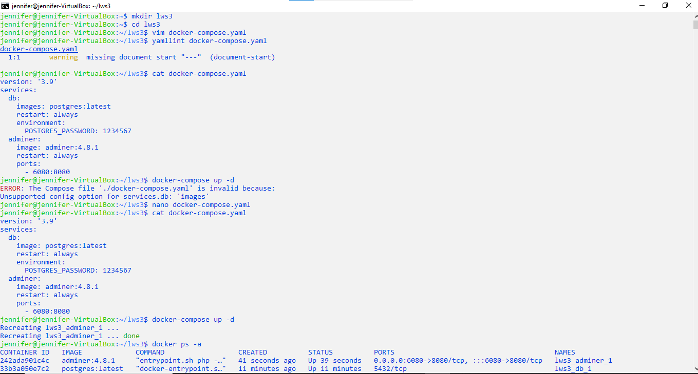

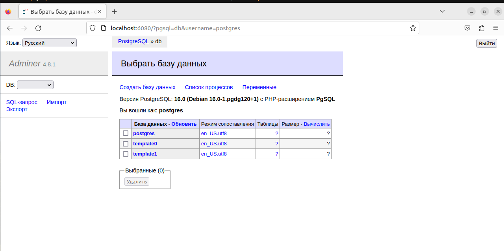

## Задание 2**: необходимо создать 3 сервиса в каждом окружении (dev, prod, lab)
## Задание 3**: по итогу на каждой ноде должно быть по 2 работающих контейнера

```
jessica@jessica:~$ sudo snap install multipass
jessica@jessica:~$ multipass --help
jessica@jessica:~$ sudo apt-get install qemu-kvm libvirt-daemon-system libvirt-clients bridge-utils
jessica@jessica:~$ sudo adduser `id -un` libvirt
jessica@jessica:~$ sudo adduser `id -un` kvm
jessica@jessica:~$ newgrp kvm 
jessica@jessica:~$ newgrp libvirt
jessica@jessica:~$ virsh list --all
jessica@jessica:~$ sudo ls -la /var/run/libvirt/libvirt-sock
jessica@jessica:~$ modprobe -a kvm
jessica@jessica:~$ lsmod | grep kvm
jessica@jessica:~$ sudo systemctl enable libvirtd
jessica@jessica:~$ sudo systemctl start libvirtd
jessica@jessica:~$ sudo systemctl status libvirtd
jessica@jessica:~$ kvm-ok
jessica@jessica:~$ multipass set local.passphrase
jessica@jessica:~$ multipass list
jessica@jessica:~$ multipass find
jessica@jessica:~$ multipass launch core18 --name master
jessica@jessica:~$ multipass launch core16 --name master

```
Вскоре из-за требовательных к памяти образов multipass виртуальная машина сломалась.
Пришлось создать клон другой машины.

```
jennifer@jennifer-VirtualBox:~$ multipass launch core --name master 
jennifer@jennifer-VirtualBox:~$ multipass launch core --name worker1
jennifer@jennifer-VirtualBox:~$ multipass launch core --name worker2
jennifer@jennifer-VirtualBox:~$ multipass list 
jennifer@jennifer-VirtualBox:~$ multipass shell master
ubuntu@master:~$ sudo snap install docker 
ubuntu@master:~$ sudo docker swarm init
ubuntu@master:~$ docker network create --driver overlay --subnet 4.5.6.0/24 test-network --attachable
ubuntu@master:~$ docker network ls     
ubuntu@master:~$ exit
jennifer@jennifer-VirtualBox:~$ multipass shell worker1  
ubuntu@worker1:~$ sudo snap install docker
ubuntu@worker1:~$ docker network ls 
ubuntu@worker1:~$ docker swarm join --token SWMTKN-1-128b0bq4tpcbd816nil1v7zis27v1rbfs6zxi2at82m9z2k3cc-37rvzqho19u8mgnqp0sxwuw53 10.164.68.119:2377
ubuntu@worker1:~$ docker network ls 
ubuntu@worker1:~$ exit
jennifer@jennifer-VirtualBox:~$ multipass shell worker2  
ubuntu@worker2:~$ sudo snap install docker
ubuntu@worker2:~$ docker network ls 
ubuntu@worker2:~$ docker swarm join --token SWMTKN-1-128b0bq4tpcbd816nil1v7zis27v1rbfs6zxi2at82m9z2k3cc-37rvzqho19u8mgnqp0sxwuw53 10.164.68.119:2377
ubuntu@worker2:~$ docker network ls 
ubuntu@worker2:~$ exit
jennifer@jennifer-VirtualBox:~$ multipass shell master
ubuntu@master:~$ docker network ls  
ubuntu@master:~$ docker node ls
ubuntu@master:~$ docker run -d --name some-mysql1 -e APP_ENV=development --restart=always mysql:8.0.31  
ubuntu@master:~$ docker run -d --name adminer-1 -e APP_ENV=development --restart=always --link some-mysql1:db -p 8081:80 adminer:4.8.1     
ubuntu@master:~$ docker ps -a 
ubuntu@master:~$ docker exec adminer-1 /usr/bin/env  
ubuntu@master:~$ exit
```
На скриншотах видно, что я пыталась прописать подключение контейнеров к созданной мною сети test-network, но не получилась ни разу. Сеть определяется, она есть, но 
контейнеры к ней так и не подключились.
```
jennifer@jennifer-VirtualBox:~$ multipass shell worker1  
ubuntu@worker1:~$ docker run -d --name some-mysql2 -e APP_ENV=production --restart=always mysql:8.0.31
ubuntu@worker1:~$ docker run -d --name adminer-2 -e APP_ENV=production --restart=always --link some-mysql2:db -p 8081:80 adminer:4.8.1  
ubuntu@worker1:~$ docker ps -a   
ubuntu@worker1:~$ exit

jennifer@jennifer-VirtualBox:~$ multipass shell worker2
ubuntu@worker2:~$ docker run -d --name some-mysql3 -e APP_ENV=laboratory --restart=always mysql:8.0.31  
ubuntu@worker2:~$ docker run -d --name adminer-3 -e APP_ENV=laboratory --restart=always --link some-mysql3:db -p 8081:80 adminer:4.8.1     
ubuntu@worker2:~$ docker ps -a
ubuntu@worker2:~$ exit

```

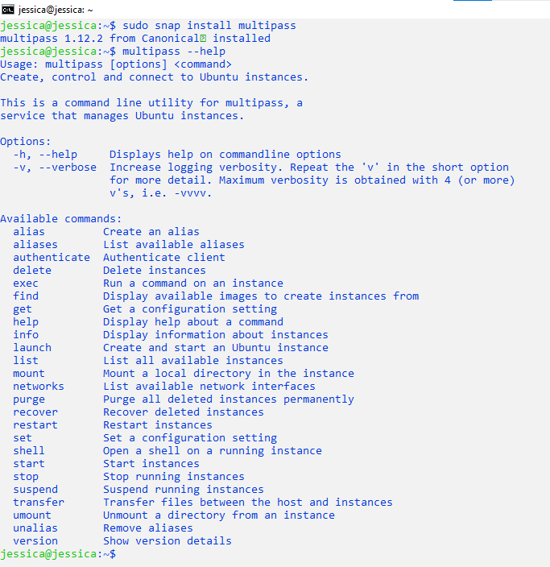

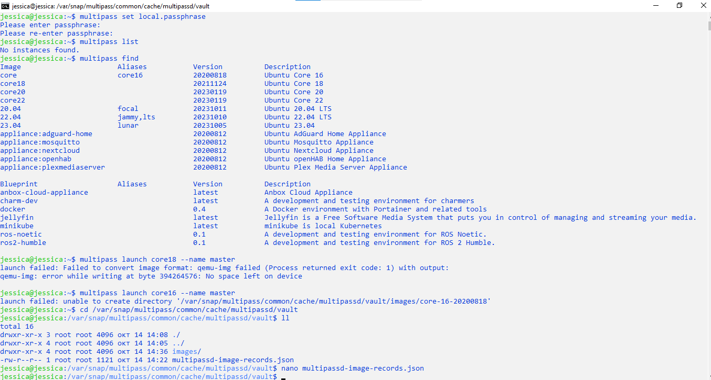

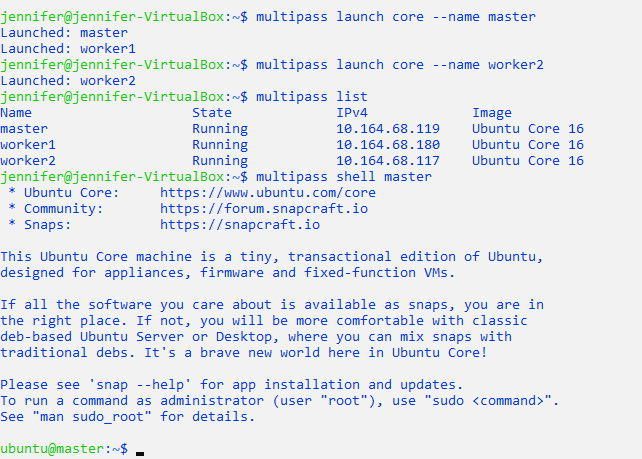

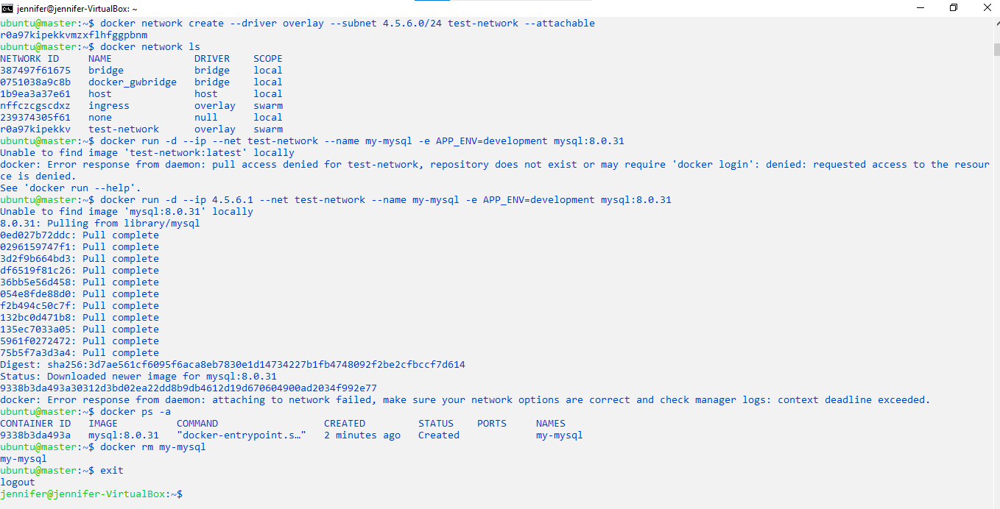

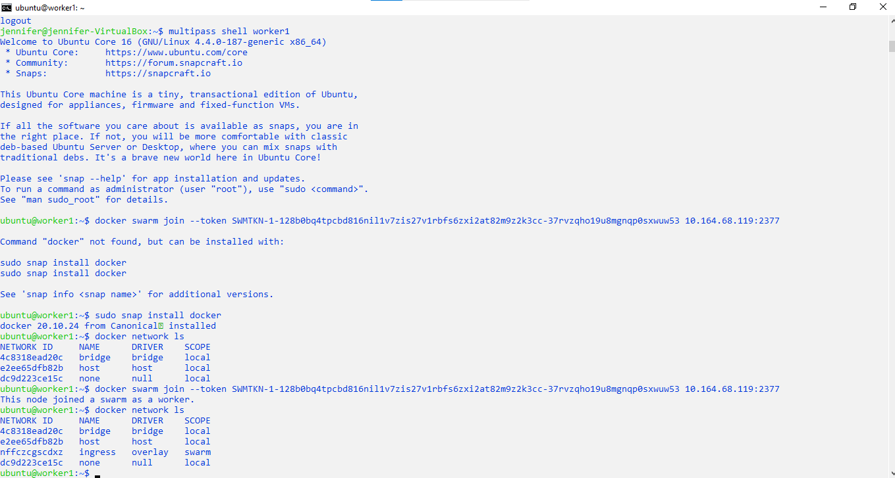

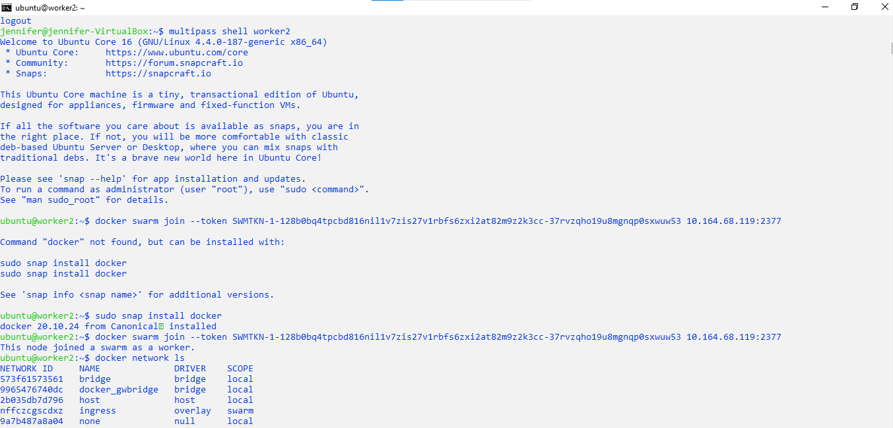

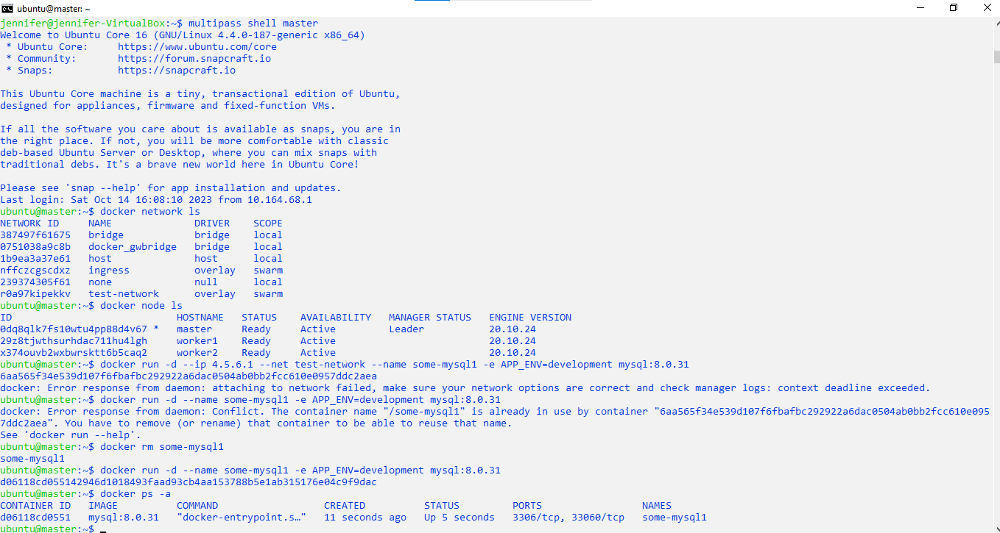

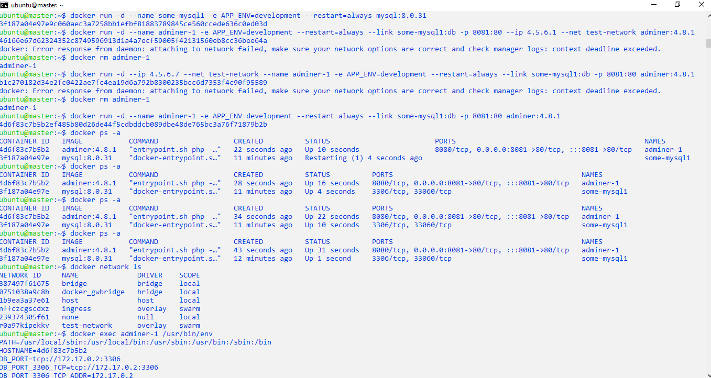


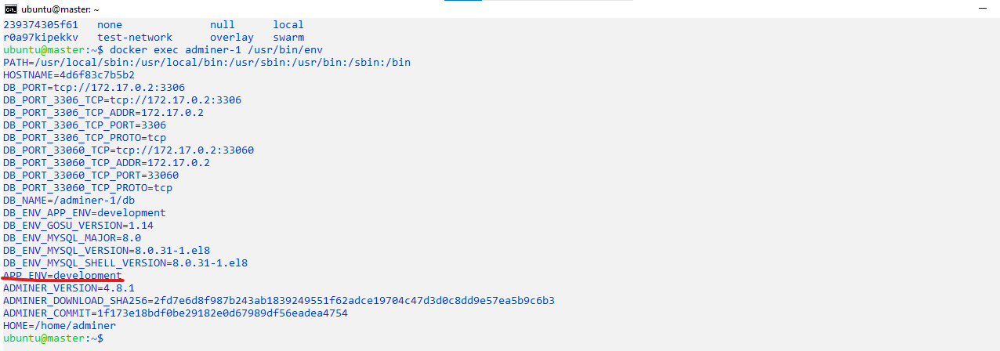

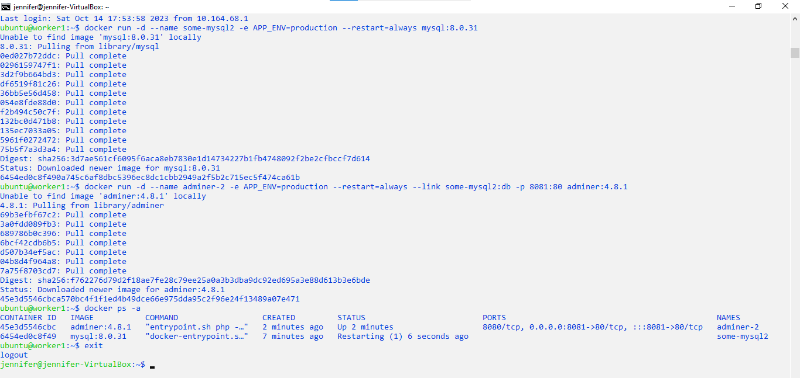

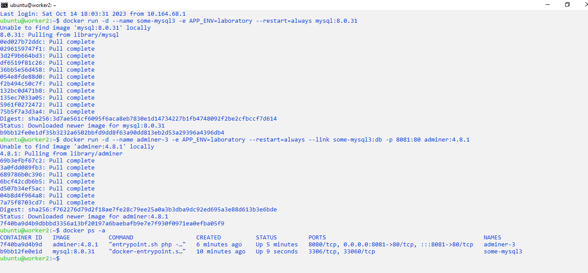

